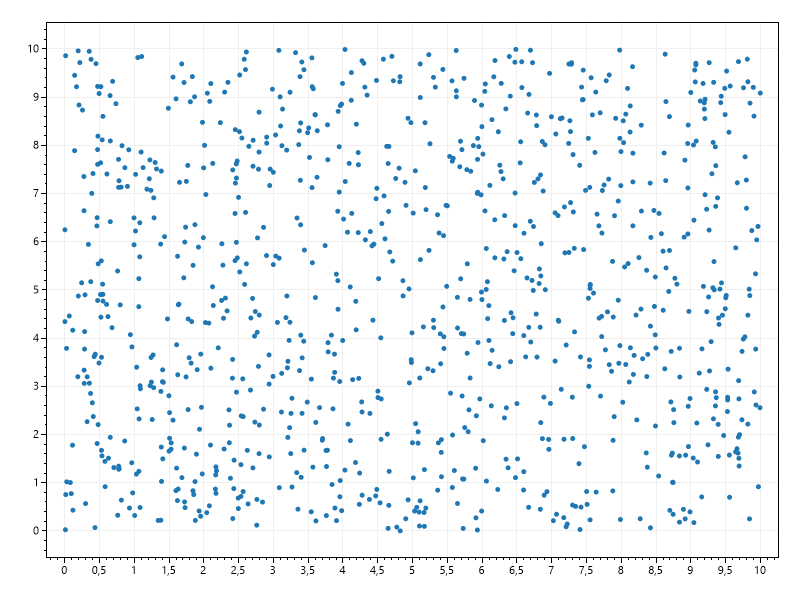
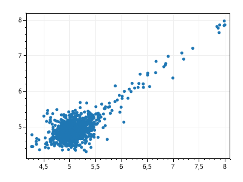
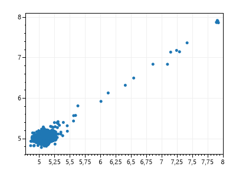
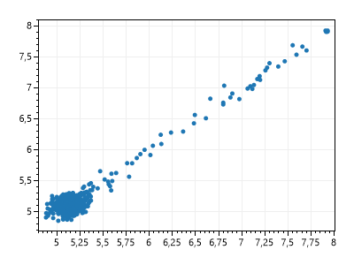
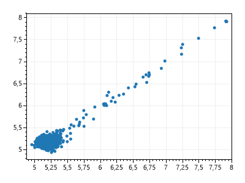
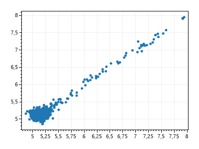

# GeneticAlgorithm
GeneticAlgorithm

# Execution Parameters
| Parametro            	| Valor 	            |
|----------------------	|-------	            |
| Tamanho da população 	| 1000    	            |
| Forma de seleção     	| Roleta  	            |
| Tipo de crossover    	| Aritimetico 	        |
| Função objetivo      	| f(x1, x2)	            |
| Função de Fitness    	| f(x1, x2) + min       |
| Número de Gerações   	| 1000    	            |
| Taxa de Crossover    	| 100% + 5 Elites       |
| Taxa de Mutação      	| 0.5      	            |

# Execution Figures

## Initial Population

## Iteration 10 

## Iteration 100 

## Iteration 200 

## Iteration 500 

## Iteration 1000 
